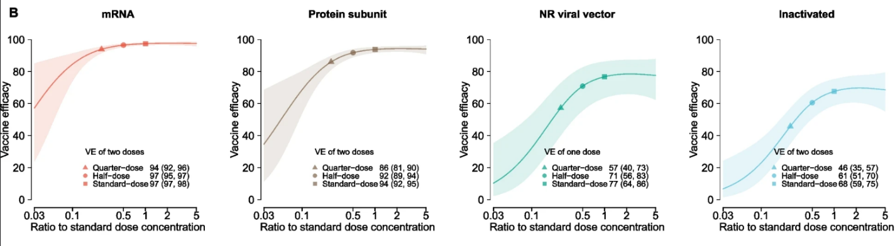

# Biology of optimal dosing {#biology-of-optimal-dosing}



## Basic rationale {#basic-rationale}

There are five groups of factors that determine the vaccine's effect. The first and most obvious to focus on is the antigen. Then there are (2) the mode of delivery, i.e. how the antigen is "packaged", but also where it is delivered[^1], (3) vaccination regimen/schedule, (4) adjuvants, (5) host factors (e.g. age). For simplicity, I will start discussing the lower doses and then touch on points 2-5 as we go.[^2]

That the lower doses are sometimes found to be non-inferior is not surprising: it is typical in clinical trials to set the "full" doses at the maximum tolerated level. In other words, when the dose-response curve is S-shaped, the developers may end up setting the default dose at the top part of the S, the "saturated" part of the response curve. A smaller dose then may have a very similar response. For a graphical illustration of this idea, see a model of fractionation of COVID-19 vaccines [here](https://bmcmedicine.biomedcentral.com/articles/10.1186/s12916-022-02600-0/figures/2); pasting the relevant part of the figure:

{width="6.486111111111111in" height="1.7895833333333333in"}

***Figure.** An illustration of an uncertain, model-derived relationship for COVID-19 vaccines. You can ignore the implications for COVID, the general point is that for a given vaccine many lower doses can lie either on "top" of the S or close to it. (For more on COVID specifically, also see [this study](https://www.thelancet.com/journals/lanmic/article/PIIS2666-5247(22)00390-1/fulltext).) Also note that this figure focuses on the magnitude of immediate response, but durability of protection is also an important consideration: again, this is intended as a generic illustration of saturating curves.*

But must the dose-response curve be *non-decreasing* in dose? What if past a certain point increasing the dose led to a *weaker* immune response? Such a claim may sound counterintuitive but it has been suggested in certain settings. On the other hand, the claim that extending gaps between two doses can lead to better immune response is, as far as I know, not controversial to any experts.

In this chapter I talk about the mechanisms. In the next chapter I bring in some perspectives from clinical development.

## Possible mechanisms {#possible-mechanisms}

What follows is definitely beyond my understanding of the immune system and is simply based on rather shallow exploration of existing literature. However, I believe it is fair to say that for many of these mechanisms there is no consensus among immunologists which would be grounded in hard empirical facts. Since observing certain mechanisms (especially in humans) is either impossible or just very hard to do, some of this is grounded in theory and computer modeling.[^3]

> **Recap of a few basic terms before we proceed**
>
> *Vaccines mostly induce adaptive immune responses. Within adaptive immunity, we distinguish two mechanisms: humoral and cellular. Humoral is antibody-mediated, involves B cells, plasma cells, and antibodies they produce. T cells do not produce antibodies, but can attack infected cells or help other immune cells; this is cellular immunity.*
>
> *Antibodies allow for neutralising pathogens before they enter cells (sterilising immunity). They are the key mechanism in vaccination and also easier to measure, hence vaccine developers often focus on them.* *All vaccines except BCG rely* mainly *on antibody-based protection.* *Many vaccines also induce a T cell response; however, it is harder to measure and we understand it less well.*[^4]

### Gaps between doses {#gaps-between-doses}

Many vaccines require multiple prime and booster doses.[^5] For COVID-19 the 2-dose Astrazeneca vaccine trials measured higher efficacy for patients who were given a lower dose and longer gap between two doses. This also mapped to antibody response. In general, many studies of different COVID vaccines have found that longer gaps (without change in dose) between 2 doses (not just of AZ vaccine) [led to more robust responses](https://doi.org/10.1016/j.cell.2021.10.011); [ditto for third dose](https://www.cell.com/cell/fulltext/S0092-8674(22)01251-X).[^6] [^7]

This was not surprising to experts, nor is it a mechanism limited to COVID; we will show a few more examples soon. In general terms, when a priming dose of a vaccine is administered, it triggers an initial immune response, activating various parts of the immune system (more on that below). Following this activation, the immune cells enter a refractory period, during which they are less responsive to further stimulation by the same antigen. This refractory period serves as a protective mechanism to prevent excessive immune activation and potential harm to the host.

To maximize the benefit of a booster dose, it should be administered after the immune system has recovered from the refractory period and has generated a pool of memory B and T cells, a quantity which is highly specific to each vaccine. Consequently, administering a booster dose too early, while the immune system is still in the refractory state, may not elicit a robust secondary response. This also means that dosing of boosters can be lower than dosing of prime dose. We will return to this in a moment.

### B cell selection stringency hypothesis {#b-cell-selection-stringency-hypothesis}

Staying with COVID example, a modeling study by Garg et al. (2021) suggests a possible explanation for the mechanism observed in the AZ study, which extends beyond delayed booster and also applies to lower doses. It can be most simply summarised as a quantity-quality trade-off that occurs in germinal centers, i.e. the locations where antigens are presented to B cells, which then leads to production of memory B cells and long-lived plasma cells (residing in bone marrow).

In that (generic, non-COVID-specific) process of affinity maturation, as B cells proliferate, they undergo [somatic hypermutation](https://en.wikipedia.org/wiki/Somatic_hypermutation) and then [clonal selection](https://en.wikipedia.org/wiki/Clonal_selection). This second step is crucial. When there is a lot of antigen, B cells with both moderate and high affinity will bind to it. When the prime dose is lower, then fewer B cells are selected, but they are on average higher affinity, leading to a stronger immune response (higher quality antibodies) from those cells when antigen is encountered again.[^8] 

The length of this process is measured in (a few) weeks. Going back to the previous subsection, the value of delayed boost can also be explained through what happens in germinal centers. Since the process of selecting cells takes time (proliferate, mutate, be selected), the length of the gap will impact the quality of immune memory.

However, it's important to note that when such trade-off is cited for a specific vaccine, it is (usually? always?) as a hypothetical mechanism that is backed by simulations and I do not know what weight to put on that hypothesis. I also have no sense of how to generalise from isolated examples to other cases, although there is no reason why it should be seen as COVID-specific. For multi-dose vaccination regimens, it is even less clear what happens to this mechanism, since we do not know whether boosting leads to formation of new germinal centers or modulation of existing ones. 

To summarise, let's reiterate three points. - First, these issues are very complex and not only beyond my own understanding, but also not well understood by the experts. - Second, while I often focus on COVID examples (because they are salient), the mechanisms likely apply in many different diseases.

### Immune memory, previous exposure {#immune-memory-previous-exposure}

The main conclusion from the previous section, however, is that we should consider lowering dosage of priming and boosting doses as two separate problems. For priming, the initial response has to be robust enough. For boosting, however, it is generally accepted among practitioners that lower doses may be better. Various vaccine development guidelines acknowledge this; e.g. [WHO](https://cdn.who.int/media/docs/default-source/biologicals/vaccine-standardization/clinical-evaluation-of-vaccines/who_trs_1004_web_annex_9.pdf?sfvrsn=902cbb42_3&download=true), pg 35: "If an immune memory response is elicited in the primary series it may be possible to achieve a robust anamnestic response using a much lower dose of an antigenic component compared to the primary series. A lower boosting dose may also provide a better safety profile (for example, as occurs with diphtheria toxoid)".

The relevant mechanism here is not limited to immunity induced by vaccination. Priming can also come from natural infection. This also means that the effectiveness of vaccines may be highly dependent on history of previous infections, as was the case with COVID-19.[^9]

However, for natural immunity, the factors that determine this are complex and disease-specific. One mechanism is over-stimulation in previously primed individuals. For example, in post-exposure TB vaccination (for a candidate vaccine H56, which subsequently stopped development at Phase 2), Billeskov et al. (2018) have shown worsening of immune response with dose  (based on empirical data, although in mice) where T cells primed by prior TB exposure were highly susceptible to over-stimulation. The findings there underscore the importance of carefully optimising antigen doses, especially for therapeutic vaccination of previously exposed/primed individuals, in order to induce T cells of optimal functional quality rather than just maximum magnitude. But we can't generalise this across pathogens, it's just an example.[^10]

### Other ideas: anti-vector immunity, interactions with adjuvants, heterologous boost {#other-ideas-anti-vector-immunity-interactions-with-adjuvants-heterologous-boost}

There are three more concepts that bear at least mentioning, but which I did not have time to cover under this initial exploration:

- **Anti-vector immunity:** For the COVID-19 AstraZeneca vaccine specifically [anti-vector immunity has been hypothesised as the responsible mechanism](https://bpspubs.onlinelibrary.wiley.com/doi/10.1111/bph.15620): that is, immune response to the adenoviral vector which delivers the SARS-CoV 2 antigen may confound the response to COVID antigen. Boosting with viral vector may simply lead to neutralisation of the vector and poor response.[^11] Currently viral vectors are used for COVID and ebola vaccines only (in development for HIV, malaria). 

- **Heterologous prime-boost** ("mix-and-match") strategies involve the activation of a broader range of immune responses.[^12] Different vaccine platforms can stimulate distinct aspects of the immune system and mixing can lead to more comprehensive immune response. It also seems to be a good way to avoid anti-vector immunity. However, this is not really in scope of this investigation.

- In **adjuvanted vaccines**, these mechanisms are further complicated by interaction of the vaccine with its adjuvant. Intuitively, given a potent adjuvant, the immune response may be less responsive to changes in dose compared to the same vaccine given without adjuvant. However, that's another topic I'd need to get more expert opinion on. For now I am just noting my ignorance.

### Extra example: malaria and RTS,S {#extra-example-malaria-and-rtss}

To better illustrate some of these points and to move focus away from solely COVID, let's look at another example that shows increasing gaps and smaller doses at the same time can lead to better responses. That is the case in RTS,S and malaria. As nicely summarised in a short editorial by McCall, Yap, and Bousema (2020), the series of the initial three RTS,S doses may work better if the third dose was smaller and delayed by several months. They provide a summary of some possible mechanisms. I am not able to parse it, but it seems that cellular immunity plays a role too in fractionation.[^13] I should note, however, that it was not clear whether the improved response was due to fractionation, delay, or both (perhaps the consensus has changed since). The affinity maturation explanation may also apply here, but overall it really is a very detailed, complicated, and not well-established mechanism: see the beginning of discussion in (Das et al. 2021).[^14]

## Table: immune memory and optimisation goals {#table-1-immune-memory-and-optimisation-goals}

Given the above, can we classify vaccines/diseases according to how lower doses are expected to perform? Clearly the mechanisms that favour lower doses or alternative vaccination regimens are highly variable, depending on pathogen/antigen/epitope complexity, the type of immune machinery that they produce, and history of natural exposures. For COVID, it has been sufficient for vaccines to present a spike protein antigen and neutralising antibodies correlated well to protection from disease. This meant that some generalisable inferences about impact of lowering doses could be made even early on in the pandemic. 

Still, since we've been focusing on immune memory, for general interest it may be instructive to delineate three groups of diseases based on that distinction, which I borrow from an excellent summary article by Pollard and Bijker (2021).

  --------------------------------------------------------------------------------------------------------------------------------------------------------------------------------------------------------------------------------------------------------------------------------------------------------------------------------------------------------------------------------------------------------------------------------------------------------------------------------------------------------------------
  Mechanism                                                                                                                                                                                            Examples                                                                                                                                                                                 Hypothetical goal of optimisation approach
  ---------------------------------------------------------------------------------------------------------------------------------------------------------------------------------------------------- ---------------------------------------------------------------------------------------------------------------------------------------------------------------------------------------- ----------------------------------------------------------------------------------------------------------------------
  **Long-lasting protection**. Antibody levels stay high enough to be protective long-term, sometimes lifetime                                                                                         yellow fever ("only 12 known cases of yellow fever post-vaccination have been identified, after 600 million doses have been dispensed" per WHO), varicella zoster, measles-mumps, HPV?   Finding the right dose to induce protection; can involve lowering doses, for vaccines that already tend to work well

  **Memory-dependent protection.** Antibody levels drop over time but when exposed, the incubation period is long enough for immune memory to kick in and offer protection                             Hib, tetanus, diptheria, polio, pneumococcal conjugate vaccine                                                                                                                           Optimising for high quality memory, e.g. via timing of doses

  **Short-term antibody-dependent protection.** Antibody levels drop rapidly, and the pathogen's incubation period is too short for memory responses to be fully protective. Re-vaccination required   influenza, pertussis (acellular?), SARS-CoV-2, cholera                                                                                                                                   Achieving high initial levels of antibodies; public health trade-offs to maximise protection
  --------------------------------------------------------------------------------------------------------------------------------------------------------------------------------------------------------------------------------------------------------------------------------------------------------------------------------------------------------------------------------------------------------------------------------------------------------------------------------------------------------------------

Three rather obvious caveats: - It's important to note that these categories are not rigid, many vaccines may exhibit characteristics of multiple groups or fall outside these classifications entirely. For example, hepatitis B vaccine requires high levels of antibodies, but is durable; malaria and BCG vaccines have more complicated mechanisms of protection. - The "long-lasting" category is of course subjective: e.g. measles protection will also disappear given enough time, as we've seen in recent outbreaks. - My hypothetical goals are also a bit of splitting hairs. In each case it depends not just on the quality of the vaccine, but also its supply and each disease needs to be considered separately.

However, the point of this simple table is that it's worth keeping in mind that biological basis for the kind of fractionation that can be done for e.g. yellow fever doesn't really translate into e.g. pandemic influenza, even though in particular situations we want to optimise doses of both of these. I work through a longlist of diseases closer to the end of this investigation, in summary of optimisation targets.

### Role of age (host factors) {#role-of-age-host-factors}

In this note, when talking about dose optimisation I generally focused on things that are good ideas on average, i.e. assuming every person gets the same dose or schedule. However, before we conclude, let's point out the obvious heterogeneity in responses.

We already mentioned previous infection status as an important host factor in vaccine response. Another one is age. It is uncontroversial to give smaller doses of vaccines to children compared to adults, as their immune systems are generally more responsive. So in children higher doses may lead to increased reactogenicity without any benefits. Conversely (and perhaps more interestingly), for influenza we recommend giving larger doses to the elderly population to overcome immunosenescence and improve vaccine efficacy. Similar schemes could also be considered in diseases with steep increase in risks with age, such as COVID. I return to this idea in the section on modeling health benefits of optimal dosing.

### References {#references}

Billeskov, Rolf, Thomas Lindenstrøm, Joshua Woodworth, Cristina Vilaplana, Pere-Joan Cardona, Joseph P. Cassidy, Rasmus Mortensen, Else Marie Agger, and Peter Andersen. 2018. "High Antigen Dose Is Detrimental to Post-Exposure Vaccine Protection Against Tuberculosis." *Frontiers in Immunology* 8 (January): 1973. <https://doi.org/10.3389/fimmu.2017.01973>.

Das, Jishnu, Jonathan K. Fallon, Timothy C. Yu, Ashlin Michell, Todd J. Suscovich, Caitlyn Linde, Harini Natarajan, et al. 2021. "Delayed Fractional Dosing with RTS,S/AS01 Improves Humoral Immunity to Malaria via a Balance of Polyfunctional NANP6- and Pf16-specific Antibodies." *Med* 2 (11): 1269--1286.e9. <https://doi.org/10.1016/j.medj.2021.10.003>.

Garg, Amar K., Soumya Mittal, Pranesh Padmanabhan, Rajat Desikan, and Narendra M. Dixit. 2021. "Increased B Cell Selection Stringency In Germinal Centers Can Explain Improved COVID-19 Vaccine Efficacies With Low Dose Prime or Delayed Boost." *Frontiers in Immunology* 12.

Keck, Simone, Mathias Schmaler, Stefan Ganter, Lena Wyss, Susanne Oberle, Eric S. Huseby, Dietmar Zehn, and Carolyn G. King. 2014. "Antigen Affinity and Antigen Dose Exert Distinct Influences on CD4 T-cell Differentiation." *Proceedings of the National Academy of Sciences of the United States of America* 111 (41): 14852--57. <https://doi.org/10.1073/pnas.1403271111>.

Mateus, Jose, Jennifer M. Dan, Zeli Zhang, Carolyn Rydyznski Moderbacher, Marshall Lammers, Benjamin Goodwin, Alessandro Sette, Shane Crotty, and Daniela Weiskopf. 2021. "Low-Dose mRNA-1273 COVID-19 Vaccine Generates Durable Memory Enhanced by Cross-Reactive T Cells." *Science* 374 (6566): eabj9853. <https://doi.org/10.1126/science.abj9853>.

McCall, Matthew B B, Xi Zen Yap, and Teun Bousema. 2020. "Optimizing RTS,S Vaccination Strategies: Give It Your Best Parting Shot." *The Journal of Infectious Diseases* 222 (10): 1581--84. <https://doi.org/10.1093/infdis/jiaa423>.

Pollard, Andrew J., and Else M. Bijker. 2021. "A Guide to Vaccinology: From Basic Principles to New Developments." *Nature Reviews Immunology* 21 (2): 83--100. <https://doi.org/10.1038/s41577-020-00479-7>.

Sanchez, Sarah, Nicole Palacio, Tanushree Dangi, Thomas Ciucci, and Pablo Penaloza-MacMaster. 2021. "Fractionating a COVID-19 Ad5-vectored Vaccine Improves Virus-Specific Immunity." *Science Immunology* 6 (66): eabi8635. <https://doi.org/10.1126/sciimmunol.abi8635>.

[^1]: To complicate this even further, this category also includes additional factors such as stabilisation of the structure of the antigen (to make it persist longer) and the number of epitopes (valency), which is beyond my simple understanding of immune responses.

[^2]: I do not really discuss the route of administration here. It is well-established that using ID delivery may produce comparable immune responses at lower doses than IM/SC injections, as I discuss in how change in dosing is implemented in practice. In this section I am talking about an apple-to-apple comparison, i.e. what happens when vaccines are administered using the same route. You can find more examples of increased immunogenicity from switching to ID delivery in e.g. fractional dosing of polio vaccine.

[^3]: To make an obvious point, this problem is compounded further when we don't understand correlates of protection, as is the case in, e.g., malaria, TB, HIV.

[^4]: "T-cell-inducing" vaccines are "vaccines designed to induce CD4+ and/or CD8+ T cells of sufficient magnitude and necessary phenotype or effector function that directly contribute to pathogen clearance via cell-mediated effector mechanisms, rather than only CD4+ T-cell help for B cells leading to protective antibody responses" These are especially a promising area for malaria research.

[^5]: In the context of COVID, "prime and boost" is used in reference to first and second dose, but it can also refer to priming with two doses and a later 3rd booster dose. Many multiple-dose vaccines are given in childhood. In that context I believe "prime" doses are the ones given within the first 6 months of life. A single vaccine can have multiple priming doses (and no booster doses).

[^6]: Of course the trade-off is extending the period where the individuals are protected by only one dose. There are several factors to consider: individual protection, public health perspective from extending protection to more people ("First Doses First"), and risk of mutations. See the section on modeling health benefits of optimal dosing.

[^7]: Sanchez et al. (2021) discuss how in 2-dose COVID Ad5 (used in Russian and Chinese vaccines) a lower initial dose led to better response following the boost. They also find very low doses of antigen generating protection from severe COVID. This may be due to response to vector, which I discuss later, but it's worth investigating this further, since it's usually the booster where we would drop the dose, not the prime. More on that below.

[^8]: To complicate this further, we should also think about T cell response and its role in immune memory. Expansion and differentiation of B cells into memory B cells, which will then persist and determine quality of future immune response, is promoted by [follicular helper T cells](https://en.wikipedia.org/wiki/Follicular_B_helper_T_cells) (TFH), a type of CD4+ cell. Generally, while stronger T cell responses are observed when activated by a high affinity antigen, the relationship between antigen dose and T cell response is less directly related to strength of response and more related to the types of cells that differentiate, including TFH (Keck et al. 2014). But I do not really understand this mechanism.

[^9]: For example, Mateus et al. (2021) found that pre-existing cross reactive T cells enhanced the efficacy of lower dose of Moderna's mRNA vaccine. There are many papers on prior infections, e.g. [Reynolds et al (2021)](https://www.science.org/doi/full/10.1126/science.abh1282) and, as I discuss in chapter on modeling health benefits of optimal dosing, this was translated into models.

[^10]: Another factor, albeit one that I have not had time to understand yet and just want to name-check topically, has to do with epitope masking. [Zarnitysyna et al](https://journals.plos.org/plospathogens/article?id=10.1371/journal.ppat.1005692) give both an overview and mathematical models of this mechanism in influenza and difficulty in creating a universal influenza vaccine that could work against the conserved part of the virus.

[^11]: AstraZeneca vaccine used two doses with the same adenovirus, but the Russian Sputnik V vaccine, also two-dose, used Ad5 and Ad26, presumably to avoid that issue.

[^12]: A lot of COVID vaccine research in 2021 focused on heterologous boosting, with generally positive results for mix-and-match approaches. [The best example was the trial in the UK.](https://www.thelancet.com/article/S0140-6736(21)02717-3/fulltext) Nowadays, I think general consensus seems to be that heterologous boosting with a good quality vaccine is a good idea.

[^13]: One of the cited articles, a 2020 paper on RTS,S delayed dose by Pallikkuth et al, references the mechanisms we discussed above right there in the title: [A delayed fractionated dose RTS,S AS01 vaccine regimen mediates protection via improved T follicular helper and B cell responses](https://pubmed.ncbi.nlm.nih.gov/32342859/)

[^14]: Another interesting topic for further research is the impact of adjuvants on dosing of malaria vaccines (RTS,S, R21) and combination with viral vectors, as in [this Nature paper by researchers from Jenner Institute](https://www.nature.com/articles/s41598-021-90290-8#:~:text=Efficacy%20of%20RTS%2CS%20can,combined%20with%20ChAd63%E2%80%94MVA%20ME.), but this is in mice.

## Further reading

- [Vaccine development perspective](vaccine-development.qmd)
- [Finding targets for optimisation; disease-specific summaries](../vaccines/index.qmd)
