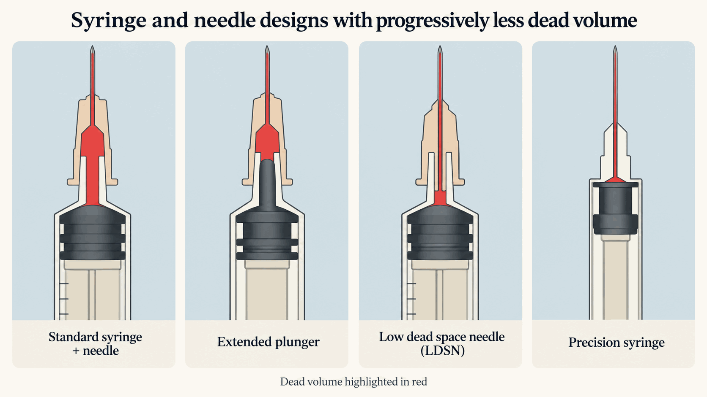
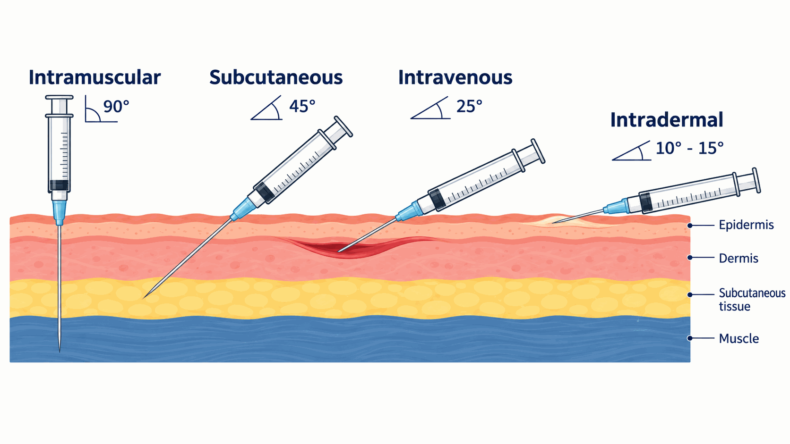

# Practical aspects of changing dose {#practical-aspects-of-changing-dose-syringes-vials-and-intradermal-delivery}

*[Syringes, vials and intradermal delivery]{.note-subtitle}*



In the case studies of polio and yellow fever fractionation we saw that a standard dose of 0.5mL was swapped for 0.1mL. In some other applications even lower doses were considered. How is that done in practice? Does splitting the "full" dose into N doses automatically mean you can vaccinate N times more people? To answer these types of questions, there are several topics it's good to get familiar with: what syringes are used to vaccinate, how splitting of vials is achieved, and intradermal vaccination.

## Syringes and wastage {#syringes-and-wastage}

Most vaccines are injected. Disposable plastic syringes have been in use since the 1960s. The traditional design has a high dead volume, meaning that there is a lot of space at the end of the syringe where the injected substance can remain, and so the injected volume is also less precise. Low dead space syringe (LDSS) was invented at first for precise insulin injections. You can also use a low dead space *needle* (LDSN) instead to reduce wastage. The different methods are show below.[^1]

{width="5.5in" fig-alt="Four syringe and needle designs showing progressively less dead volume."}

*Left to right: syringe and needle designs with progressively less dead volume (red area); adapted from [here](https://arc-w.nihr.ac.uk/research/projects/low-versus-high-dead-space-syringes-user-preferences-and-attitudes/). Second from left: extended plunger; third from left: low dead space needle in high dead space syringe. Rightmost: precision syringe used for e.g. insulin injections.*

How much of a difference can use of better syringes make in practice? A flu study with 10-dose vials estimated wastage of 2-19% (Strauss et al. 2006), but it's clearly a highly case-specific estimate. The topic saw much interest in early 2021 with the discovery that additional doses of COVID vaccines could be obtained from vials with LDSS/N. In a very nice and comprehensive quantitative study, Le Daré et al. (2021) showed that you could obtain 1-2 extra doses per vial (vials were 5-11 doses) for each of the four vaccines available in early 2021; I recommend looking at the main figure in that study. It's also instructive to see [a video of vaccine preparation and drawing an extra dose from Pfizer COVID vaccine](https://www.youtube.com/watch?v=zRHWWRRnVXo) vial to understand the extra skill involved. Overall, the healthcare workers would try (and usually succeed) in drawing these extra doses.

Jarrahian, Rein-Weston, et al. (2017) examines how many fractional doses of polio vaccines can be obtained from standard single-dose vials, using different intradermal delivery methods (more on which below). In theory, five fractional (0.1mL) doses could be taken from each vial. However, the actual number of doses obtained ranged from 3 to 5.2, depending on the device. The difference between the nominal and actual number was due to wastage, such as device dead space and wastage in the filling process.[^2]

The costs of LDSS themselves does not appear to be substantially higher than high dead space ones. Hence, various authors have recommended switching to LDSS as an industry standard for self-administered medications. However, in the case of vaccinations, where huge volumes of syringes are needed, it's an open question how much the manufacturing can be scaled up in a pandemic setting. For example, [a news article on stretching mpox vaccine](https://www.statnews.com/2022/08/23/u-s-plan-to-stretch-monkeypox-vaccine-supply-runs-into-problems/) noted that even though fractional dosing was supposed to produce five doses instead of one, in practice the number was between three and five (see also fractional dosing of mpox vaccine). Lack of LDSS was cited as a factor, suggesting that they are not so readily available even in non-pandemic mass vaccination emergencies in wealthy countries.

## Multidose vial policy: vial size, storage, and multiple punctures {#multidose-vial-policy-vial-size-storage-and-multiple-punctures}

Injectable vaccines come in vials of various sizes. As we saw, for AstraZeneca's COVID vaccine the typically used vial nominally contained 10 doses of 0.5mL. This led to variation in the number of extractable doses, all the way up to 13.

Many vaccines administered in low- and middle-income countries are purchased in multidose vials (MDVs), up to 20 doses per vial. Compared with single-use vials, MDVs sell at a lower price per dose; require lower cold chain, storage, and transport capacity; and generate less waste. Naturally, using fractionation increases the number of available doses per vial.

From the producers' standpoint, MDV is also a faster solution in a pandemic setting: it requires fewer glass vials and each vial can be filled faster (as per [Pfizer manufacturing team](https://www.politico.com/news/2020/07/18/europes-challenge-of-a-lifetime-manufacturing-enough-coronavirus-vaccines-369064))

MDV with large vials may seem like an obvious choice, then, but we don't always use it. Single dose vials or pre-filled syringes[^3] avoid contamination and may reduce wastage when there are few patients, because there is no risk that unused vaccine will have to be discarded once the open vial expires.[^4] Healthcare workers may be hesitant to open large vials to reduce waste, which could lead to missed vaccination opportunities when there aren't enough people to vaccinate.

Lee et al. (2010) provide a good overview of these issues, together with economic modelling of when MDV is preferable. They even derive vaccine-specific patient thresholds required to justify use of MDVs. Cost per dose can vary hugely between different vial options depending on demand, but it's hard to generalise from this since this is only a theoretical computation.

Heaton et al. (2017) review ten studies on how the number of doses per vial affects various aspects of immunisation systems such as costs, coverage, wastage, contamination. Predictably, the optimal MDV policy is highly case-specific. Studies differ in estimates of how costs are impacted. Using low-capacity MDVs reduces wastage, [^5] but can also lower availability, e.g. because of the higher cold chain burden. One study found that contamination risk was not statistically higher with higher-capacity MDVs.[^6] The review also cites measles outbreaks in Ethiopia and Zanzibar, where vaccination rates were lower due to HCWs not opening vials to minimise wastage.

In addition to wastage, there is also the issue of vial stoppers. Each vial has a rubber stopper at the top. Their quality is specified and tested as part of e.g. WHO's prequalification. In assessing suitability of YF and polio vaccines for fractionation, there was no problem with additional punctures (Jarrahian, Myers, et al. 2017), so we should a priori assume that this is possible for all vaccines. However, the manufacturing guidelines are typically for fewer punctures that FD would require, so this needs to be verified every time. Moreover, in the [mpox case](https://www.statnews.com/2022/08/23/u-s-plan-to-stretch-monkeypox-vaccine-supply-runs-into-problems/) there also appeared to be a problem with vial stoppers being loose, which made it hard to deliver many doses. But this may be anecdata.

> **Quick reminder on what routes different vaccines use**
>
> ***Mucosal**: flu (nasal), cholera and rotavirus (oral), polio (oral)*
>
> ***Intramuscular** (most vaccines): COVID, flu, polio, hepB, DTP, HPV, PCV, ...*
>
> ***Subcutaneous** (typically live vaccines): MMR, YF, varicella, zoster*
>
> ***Intradermal**: BCG TB, also possible for rabies*

## Intradermal delivery and new technologies for ID {#intradermal-delivery-and-new-technologies-for-id}

Typically, injectable vaccines are delivered into the muscle (often inactivated vaccines) or subcutaneously (often live vaccines). Intradermal injections are routinely used for the BCG vaccine (using a specialised needle and syringe). The basic technique of ID injection (originally developed for TB) is to use an oblique angle when piercing the skin, like so:

{width="5.5in" fig-alt="Diagram comparing injection angles and depths across skin layers."}

Using ID injections targets dermis layer of the skin, which is rich in antigen-presenting cells and facilitates vaccines reaching lymph nodes. This means ID can elicit broad and lasting responses using both innate and adaptive immunity. For this reason, it is seen as a natural choice for fractionation, since it can lead to a more potent immune response at lower doses compared to SC or IM delivery. Schnyder et al. (2020) provide a fantastic overview of ID vs IM/SC studies up to 2020.[^7]

With this in mind, why wouldn't more vaccines be administered intradermally? First, there are more local reactions with ID injections, which may make them less acceptable; as I will discuss below, some ID methods may however be relatively painless compared to IM injections.[^8] However, the main issue raised by decision makers is that it is a more difficult technique which requires special training and can lead to less consistent results. (Experts seem to differ on this point.) The reasons for this difficulty lie in the precise depth and angle a traditional syringe has to be positioned in order to give an ID injection.

With this in mind, several ID technologies have been developed as alternatives to traditional BCG needle and syringe:

- **Adapters** which can be placed on regular syringes and limit the depth and angle of the needle during injection. See [Tsals et al](https://pubmed.ncbi.nlm.nih.gov/25964169/) for an early trial. A more recent study, Bashorun et al. (2022), notes that the unit cost for injections via intradermal adapters is much higher than injections via a traditional BCG needle and syringe, but that this cost might be largely offset when the effect of dose sparing (eg fractionation) and reduced operational costs (including training HCWs) is accounted for. (Also see note on fIPV below.) The ID adapter technology was [supported by PATH](https://media.path.org/documents/DT_ID_Adapter_Technology_Updates_fs.pdf), but there are no recent reports on its use, nor on the commercial adapter produced by West Pharmaceutical Services that was used in both of the studies mentioned above.

- **Jet injector devices** are an old technology which has been largely retired due to safety concerns. However, a new generation of jet injectors, such as the ID Pen Injector, [MIT Canada's MED-JET H4](https://mitneedlefree.com/products/), and [Tropis](https://pharmajet.com/tropis-id/) have been developed and do not have the same contamination risks as old injectors. It consists of a small injection device and disposable syringe.[^9] Tropis has been used for polio and pre-qualified by the WHO in 2018.[^10] The production was scaled up after [it was authorised for COVID-19 vaccines](https://www.businesswire.com/news/home/20230628015647/en/).[^11]

- **Microneedles** are needles less than about 1 mm long which can be mounted on regular syringes or delivered using arrays/patches. (*Since writing this I learned that Open Phil commissioned a separate investigation into this topic, hence I did not look into this more; I leave this note here for posterity.*) They are easy to deliver and almost painless, but it's largely a futuristic technology. They include [NanoPass' MicronJet](https://www.nanopass.com/applications/therapeutics/) which has received FDA clearance as an ID delivery device,[^12] [DebioJect](https://www.debiotech.com/debioject/),[^13] and [VAX-ID](https://idevax.com/device/).[^14] Jarrahian, Rein-Weston, et al. (2017) uses all of these devices in their study, but note that higher costs and cold chain requirements of pre-filled microneedle devices mean they may be inappropriate for use in LMICs. See Menon et al. (2021) for an overview.

The largest use case of ID fractionation to date is fractional dosing of polio vaccine. Okayasu et al. (2017) provide a very nice overview of different devices that were evaluated in clinical studies of fIPVs: adapter, syringe with short needles, microneedle, and jet injectors. It seems that adapters and Tropis were assessed most favourably, although their cost is 10-20x higher than conventional syringes. In large scale rollouts BCG needles were used. Bashorun et al. (2022) compare the three methods.

Technologies that avoid large needles are important as they may reduce vaccine hesitancy. A number I often saw cited was 1 in 10 people fear needles, but I have not found a good source for this. McLenon and Rogers (2019) note that approximately 1 in 13 healthcare workers in hospitals avoided influenza vaccination because of a fear of needles.

I close this section by noting an obvious question I was not able to answer: why are LDS syringes not used for all medications? They reduce waste, are not considerably more expensive, and are readily available (insulin syringes are commonly LDS). It's unclear to me why standard, high dead space syringes would be used at all, unless the small cost difference adds up dramatically at scale. Is there some kind of market failure there?

### References {#references-2}

Bashorun, Adedapo O., Mariama Badjie Hydara, Ikechukwu Adigweme, Ama Umesi, Baba Danso, Njilan Johnson, Ngally Aboubacarr Sambou, et al. 2022. "Intradermal Administration of Fractional Doses of the Inactivated Poliovirus Vaccine in a Campaign: A Pragmatic, Open-Label, Non-Inferiority Trial in The Gambia." *The Lancet Global Health* 10 (2): e257--68. <https://doi.org/10.1016/S2214-109X(21)00497-6>.

Heaton, Alexis, Kirstin Krudwig, Tina Lorenson, Craig Burgess, Andrew Cunningham, and Robert Steinglass. 2017. "Doses Per Vaccine Vial Container: An Understated and Underestimated Driver of Performance That Needs More Evidence." *Vaccine* 35 (17): 2272--78. <https://doi.org/10.1016/j.vaccine.2016.11.066>.

Jarrahian, Courtney, Daniel Myers, Ben Creelman, Eugene Saxon, and Darin Zehrung. 2017. "Vaccine Vial Stopper Performance for Fractional Dose Delivery of Vaccines." *Human Vaccines & Immunotherapeutics* 13 (7): 1666--68. <https://doi.org/10.1080/21645515.2017.1301336>.

Jarrahian, Courtney, Annie Rein-Weston, Gene Saxon, Ben Creelman, Greg Kachmarik, Abhijeet Anand, and Darin Zehrung. 2017. "Vial Usage, Device Dead Space, Vaccine Wastage, and Dose Accuracy of Intradermal Delivery Devices for Inactivated Poliovirus Vaccine (IPV)." *Vaccine* 35 (14): 1789--96. <https://doi.org/10.1016/j.vaccine.2016.11.098>.

Kanagat, Natasha, Kirstin Krudwig, Karen A. Wilkins, Sydney Kaweme, Guissimon Phiri, Frances D. Mwansa, Mercy Mvundura, et al. 2020. "Health Care Worker Preferences and Perspectives on Doses Per Container for 2 Lyophilized Vaccines in Senegal, Vietnam, and Zambia." *Global Health: Science and Practice* 8 (4): 680--88. <https://doi.org/10.9745/GHSP-D-20-00112>.

Le Daré, Brendan, Astrid Bacle, Roxane Lhermitte, François Lesourd, and Yves Lurton. 2021. "Increasing Vaccine Supply with Low Dead-Volume Syringes and Needles." *International Journal of Pharmaceutics* 608 (October): 121053. <https://doi.org/10.1016/j.ijpharm.2021.121053>.

Lee, Bruce Y., Bryan A. Norman, Tina-Marie Assi, Sheng-I Chen, Rachel R. Bailey, Jayant Rajgopal, Shawn T. Brown, Ann E. Wiringa, and Donald S. Burke. 2010. "Single Versus Multi-Dose Vaccine Vials: An Economic Computational Model." *Vaccine* 28 (32): 5292--5300. <https://doi.org/10.1016/j.vaccine.2010.05.048>.

McLenon, Jennifer, and Mary A. M. Rogers. 2019. "The Fear of Needles: A Systematic Review and Meta-Analysis." *Journal of Advanced Nursing* 75 (1): 30--42. <https://doi.org/10.1111/jan.13818>.

Menon, Ipshita, Priyal Bagwe, Keegan Braz Gomes, Lotika Bajaj, Rikhav Gala, Mohammad N. Uddin, Martin J. D'Souza, and Susu M. Zughaier. 2021. "Microneedles: A New Generation Vaccine Delivery System." *Micromachines* 12 (4): 435. <https://doi.org/10.3390/mi12040435>.

Okayasu, Hiromasa, Carolyn Sein, Diana Chang Blanc, Alejandro Ramirez Gonzalez, Darin Zehrung, Courtney Jarrahian, Grace Macklin, and Roland W. Sutter. 2017. "Intradermal Administration of Fractional Doses of Inactivated Poliovirus Vaccine: A Dose-Sparing Option for Polio Immunization." *The Journal of Infectious Diseases* 216 (Suppl 1): S161--67. <https://doi.org/10.1093/infdis/jix038>.

Schnyder, Jenny L., Cornelis A. De Pijper, Hannah M. Garcia Garrido, Joost G. Daams, Abraham Goorhuis, Cornelis Stijnis, Frieder Schaumburg, and Martin P. Grobusch. 2020. "Fractional Dose of Intradermal Compared to Intramuscular and Subcutaneous Vaccination - A Systematic Review and Meta-Analysis." *Travel Medicine and Infectious Disease* 37: 101868. <https://doi.org/10.1016/j.tmaid.2020.101868>.

Strauss, Kenneth, André van Zundert, Anders Frid, and Vincenzo Costigliola. 2006. "Pandemic Influenza Preparedness: The Critical Role of the Syringe." *Vaccine* 24 (22): 4874--82. <https://doi.org/10.1016/j.vaccine.2006.02.056>.

[^1]: What are the volumes we're discussing? For COVID, of the initially approved vaccines: Moderna and AstraZeneca vaccines were injected at 0.5mL, Pfizer vaccine 0.3mL, paediatric vaccinations 0.1mL. Dead space can be as low as 0.03mL up to 0.1mL depending on syringe/needle. By the way, insulin injection uses a similar range of 0.3-1mL, but needs a short needle, 5-13mm, because it's not delivered into the muscle. Vaccination into a deltoid muscle is done with a 1-inch needle.

[^2]: Some volume is also left behind as wastage in a vial after all possible doses have been extracted; the amount of wastage depends on the device used. Jarrahian, Rein-Weston, et al. (2017) found that the volume retained in vials ranged between 17μL and 312μL (equivalent to over three 0.1mL fractional doses wasted) - although they do not indicate which devices produced the most vial-retained wastage.

[^3]: A pre-filled syringe is used e.g. for routine influenza vaccination. More and more, in wealthy countries these are considered as they can save healthcare worker time, which supposedly offsets the additional costs. A new Pfizer COVID vaccine (for 2023-2024) can also come in a pre-filled syringe instead of a single dose vial. If pre-filled syringes became a default mode of distribution for some future vaccines, this would make fractionation impossible. But this seems unlikely in a pandemic, since it is faster to manufacture large quantities of MDV.

[^4]: As nicely summarised by Kanagat et al. (2020) (discussing the health care workers' perspective): *"Some vaccines contain preservatives, whereas others do not. Under the WHO's multidose vial policy, remaining doses in open vials of vaccines with preservatives can be used for up to 28 days after opening, as long as storage and proper handling conditions are met. However, vaccines without preservatives must be used in a much shorter time frame. Vaccines such as BCG, measles-containing vaccine (MCV), and yellow fever vaccines do not contain preservatives, and they must be discarded within 6 hours of reconstitution or at the end of a session, whichever comes first. Health care workers (HCWs) in low- and middle-income countries who administer these vaccines to their target populations are therefore responsible for deciding when to open a vial, knowing that if not all doses are used within a short frame of time, they will have to be discarded, resulting in open-vial wastage."* See also [WHO policy](https://www.who.int/publications-detail-redirect/WHO-IVB-14.07).

[^5]: In a four-country study, by switching from 10-dose to 5-dose vials, the estimated open vial wastage rate fell by between 56% and 44% across the countries. However, the costs per dose increased due to higher procurement and cold chain costs.

[^6]: Generally, MDVs are presumed to have a higher risk of contamination as they are used and handled multiple times - the higher their capacity, the higher the risk. For the cited study contamination risk was not part of the original study design, so this particular finding may be biased.

[^7]: There is some literature specifically on experiments comparing ID vs IM delivery of the *same* doses, but it's not something we test comprehensively.

[^8]: \[On the other hand\], "The intradermal administration of fractional doses of inactivated poliovirus vaccine appears to be safe and preferred by parents and health care providers. A questionnaire administered to parents of infants in the fractional-dose group reported a strong preference for this route of administration. When the parents were asked why they preferred intradermal administration, the vast majority of parents responded with a comment that 'the baby does not cry.'"

[^9]: [Resik et al](https://www.sciencedirect.com/science/article/pii/S0264410X14015643) analyses the immune responses from fractional IPV (polio vaccines) administered by Tropis and the ID Pen. Compared to the BCG syringe, there is no difference in immune response for Tropis, but the ID Pen is significantly lower.

[^10]: Tropis was piloted for fractional dose of IPV vaccine in Pakistan and Somalia and now in Nigeria, under a USD 1.5M grant from USAID DIV, see [here](https://divportal.usaid.gov/s/project/a0gt0000001p7OyAAI/evaluating-the-impact-of-a-needlefree-delivery-device-on-polio-immunization).

[^11]: It's hard to say how cost competitive the technology would be at scale. The cost of the device is in the hundreds of dollars, but per WHO specification it can deliver 30,000 injections. Syringe costs are likely in cents, compared to traditional single-use syringes which cost between US\$0.03-0.04 [according to the WHO](https://iris.who.int/bitstream/handle/10665/250144/9789241549820-eng.pdf?sequence=1&isAllowed=y).

[^12]: [Levin et al](https://doi.org/10.1080/21645515.2015.1010871) provide an early review of clinical evidence for the MicroJet device.

[^13]: [Vescovo et al](https://www.sciencedirect.com/science/article/pii/S0264410X16309422) compare the efficacy of rabies vaccinations in healthy 18-50 year-olds using 3 different injection routes: ID using the DebioJect microneedle device, ID with a standard needle using the Mantoux method, and intramuscularly with a standard needle. Metrics of pain were significantly lower using DebioJect, and no significant differences in immune responses/levels of protection were observed between the 3 routes. However, the 3 sample groups only had 22 volunteers in them each.

[^14]: Two very early stage trials of VAX-ID: [this](https://www.sciencedirect.com/science/article/pii/S0264410X18316761) and [this](https://www.sciencedirect.com/science/article/pii/S0264410X23006928)

## Further reading

- [Case study: mpox vaccine](../case-studies/mpox.qmd)
- [Case study: yellow fever](../case-studies/yellow-fever.qmd)
